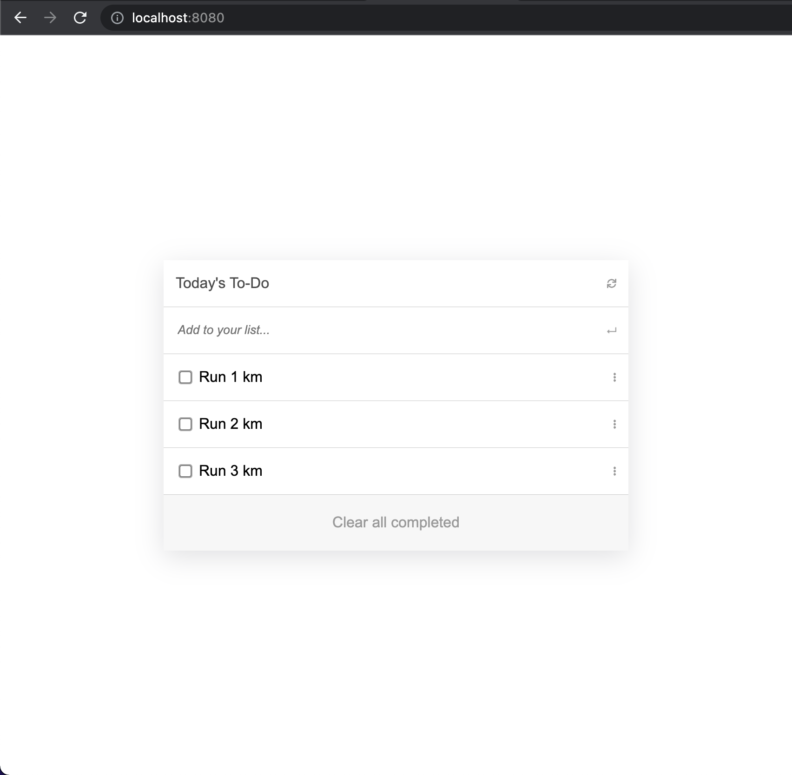

<h1 align="center">To-Do List</h1>

## About The Project

> This is an app to store, display and remove task from your list. The main funtinality is adding, editing, deleting and drag and drop. This project has been built with the help of modern CSS3 and ES6. Build using webpack. Check the live demo to try



### Prerequisites

    - node

### Setup

> Clone the repository to your local machine and run:
```
npm install
npm init -y
npm install --save-dev webpack
npm install --save lodash
npx webpack --config webpack.config.js
npm install webpack webpack-cli --save-dev
npm install --save-dev style-loader css-loader
npm install --save-dev csv-loader xml-loader
npm install --save-dev html-webpack-plugin
npm install --save-dev webpack-dev-server
```

### Deployment

 > run:
 ```
 npm run build
 npm start
 ```

## Authors

👤 **Author1**

- GitHub: [@carloshs1994](https://github.com/carloshs1994)
- Twitter: [@twitter]()
- LinkedIn: [LinkedIn]()

## 🤝 Contributing

Contributions are what make the open source community such an amazing place to be learn, inspire, and create. Any contributions you make are **greatly appreciated**.

1. Fork the Project
2. Create your Feature Branch (`git checkout -b feature/NewFeature`)
3. Commit your Changes (`git commit -m 'Add some NewFeature'`)

Feel free to check the [issues page](../../issues/).

## Show your support

Give a ⭐️ if you like this project!

## Acknowledgments

- Hat tip to Microverse
- [Inspiration](https://www.youtube.com/watch?v=AcUd-_Yjjqg)

## 📝 License

This project is [MIT](./MIT.md) licensed.
